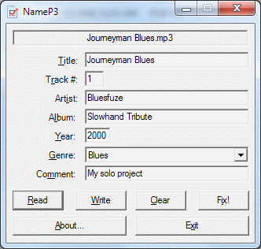

# NameP3
  
MP3 Tag Fixer and MP3 Renamer.
Back in the old days when I used to collect (ahem...) MP3s, I was very unhappy with the way the tags were formatted. So I wrote a tool of my own which auto-magically formats the tags and also renames the MP3 file using the tag information. Ofcourse, the way it formats the MP3 tag and file name is as per my taste. However, this can be tweaked. The tool will format things like artist, title, abum case (i.e. convert the words to proper case). Select the correct genre. Enforce a track number. Yada yada. To do all of this I use the UltraID3Lib .Net library (http://home.fuse.net/honnert/UltraID3Lib/) (DEAD LINK). As usual, there is no warranty of any kind. Use this at your own risk.
